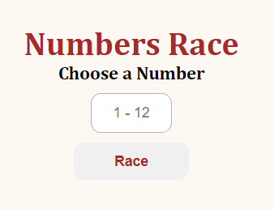

# Numbers Race

A twelve numbers array it's given to the player who selects one of that numbers. When the button race is clicked, it shows the top 3 (gold, silver, bronze) of the shuffled array.

To build this was utilized DOM manipulation with JS.

## Preview Picture

### See in action

If you want to see how it works, I recommend [forking](https://docs.github.com/en/get-started/quickstart/fork-a-repo) this repo and open in an IDE, a Source-code editor, or in a browser.

## Tecnologies

## Author

Hugo Teixeira - 8Dev - Djbetamax

### Contact links

